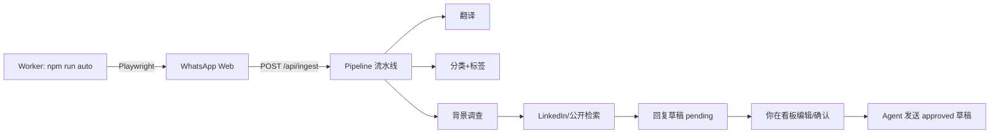

# Agent 操作手册（Playbook）

本手册定义自动化工作流。系统默认 **全自动**：WhatsApp 扫描 → ingest → 翻译 → 分类 → 标签 → 背景调查 → **LinkedIn/公开资料检索** → 草稿。

看板地址：`http://localhost:3000` · 自动化页：`/automation`

---

## 全自动架构



### 启动方式

1. **看板**：`npm run dev` → http://localhost:3000
2. **每日定点扫 WhatsApp**：`npm run auto`（默认 **10:00、15:00** 本地时间；看板 `/automation` 可改）
3. **单次扫描**：`npm run auto:scan-once`
4. **仅重跑流水线**（不扫 WA）：看板 `/automation` →「立即跑一遍全流程」或 `npm run pipeline:all`

---

## Pipeline 自动规则（ingest 后默认执行）

| 步骤 | 说明 |
|------|------|
| 翻译 | 词典 + MyMemory API → 写入 `translatedZh` |
| 分类 | catalog / project / quote / other（关键词） |
| 标签 | 国家、意向、来源、待同步等 |
| 背景 | 已知资料库 + 行业推断，`verified=false` |
| LinkedIn | 扫描结束后自动 `POST /api/research/linkedin`（DuckDuckGo 检索，需人工核实） |
| 草稿 | 按语言模板生成 `pending`（跳过内部/同行/未同步/餐饮误点） |

传 `auto: false` 可跳过 Pipeline（仅 raw ingest）。

---

## ingest 扩展字段

```json
{
  "auto": true,
  "waProfileName": "~Lora Bergiy",
  "isBusinessAccount": false,
  "businessName": null,
  "sourceHint": "instagram",
  "customer": { "phone": "+971509464300", "waChatId": "+971 50 946 4300" },
  "messages": [{ "direction": "in", "originalText": "..." }]
}
```

---

## 人工环节（安全保留）

- **草稿发送**：默认不自动发消息；你在看板确认 `approved` 后，对我说「把已确认的草稿发出去」。
- **背景核实**：看板点「标记已核实」。
- **WhatsApp 标签回写**：确认后我点 WA label 并 PATCH `syncedToWa`。

---

## 接口速查

| 方法 | 路径 | 用途 |
|------|------|------|
| POST | `/api/ingest` | 写入 + 自动 Pipeline |
| POST | `/api/pipeline/run` | `{ "all": true }` 或 `{ "customerId": "..." }` |
| GET/PATCH/POST | `/api/automation` | 状态 / 开关 / scan-once / pipeline-all / enrich-all |
| POST | `/api/research/linkedin` | `{ "customerIds": [...] }` 或 `{ "all": true }` |
| PATCH | `/api/drafts/{id}` | 编辑草稿 / 改状态 |

---

## 常用指令（对话触发，等价于 Worker）

- 「扫一遍新消息」→ 等同 `auto:scan-once`（含 LinkedIn 检索）
- 「跑一遍全流程」→ pipeline-all
- 「补跑 LinkedIn 背景」→ `npm run research:linkedin` 或 enrich-all
- 「把已确认的发出去」→ 发送 approved 草稿

---

## 云端团队版 · 扫描机 SOP

**你（admin）的电脑常开，同事只看 Vercel 看板。**

1. 配置 `.env.scanner`（见 `.env.scanner.example`）：
   - `HUB_URL=https://你的项目.vercel.app`
   - `INGEST_SECRET=` 与 Vercel 环境变量一致
2. 运行 `npm run hub`（看板本地 + Worker，或仅 Worker 连线上）
3. Chrome 保持 WhatsApp 登录，勿退出
4. 故障：查 `.wa-scan.log`、线上 `/automation`
5. Clerk：你在 Dashboard 设 `publicMetadata.role=admin`；同事邀请后默认 sales

部署步骤见 [DEPLOY.md](DEPLOY.md) · [CLOUD-PLAN.md](CLOUD-PLAN.md)
